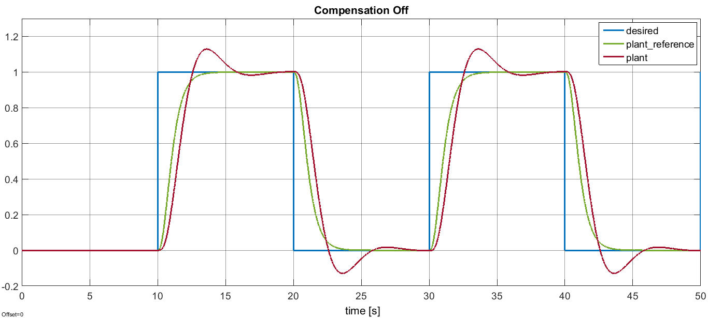

Minimum Jerk
============

This example shows how to model systems with Simulink to then generate C/C++ code
out of it that can be conveniently interfaced with [**`YARP`**](https://github.com/robotology/yarp).

Here's below a picture of the model whose code we want to obtain.

Briefly, we have a simple scheme of a well known _Reference Model Control_
approach where the plant is supposed to be a pure integrator but in reality it's not.

Therefore, if we run the simulation with the parameter's value `CompensatorState.Off`,
we get the following responses.

Clearly, the plant output (red) does not follow the desired trajectory (green) accurately enough
when the system is provided with the stepwise input (blue).

To tackle the unknown discrepancies, a **PI** compensator can be designed, which is
constantly fed by the error between the response of the actual plant and the
response of the reference plant (i.e. the pure integrator in this case).

If we enable the compensator by setting the parameter's value equal to
`CompensatorState.On`, we get the nicer tracking visible below.

Finally, a third possibility is also given corresponding to the parameter's value
equal to `CompensatorState.Auto`. In this case the **PI** compensator will automatically
switch `on`/`off` according to some internal thresholds the user can have access to.

Once done with the simulation, the model can be compiled through the **Simulink Coder**
to generate the equivalent C++ code already available in [`auto_src`](./code/auto_src) directory.

The auto-generated code has a clear interface composed of input and output structures
and variables so as the structure and variable devoted for the handling of the parameters.
It's thus straightforward to integrate it in a `YARP` project to control in velocity a joint
of the simulator (which should behave like an integrator).

The [`scope.xml`](./code/scope.xml) file can be used along with the [`yarpscope`](http://www.yarp.it/yarpscope.html)
tool in order to visualize the behavior of the overall system.
